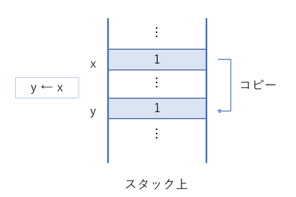
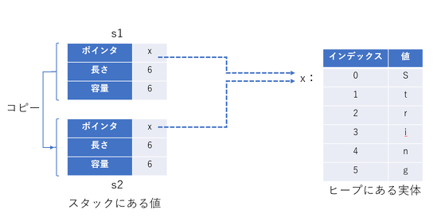
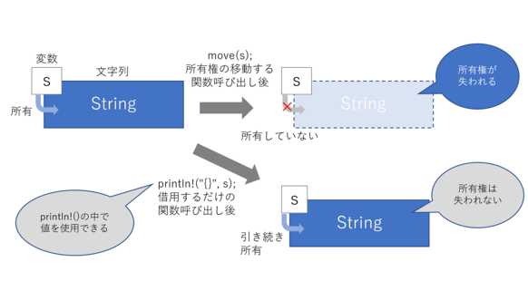

# ■ 背景・目的
### ● Rustのお勉強のため
### ● atmarkIT の RUST お勉強講座
- URL: https://atmarkit.itmedia.co.jp/ait/series/24844/
- Github: https://github.com/wateryinhare62/atmarkit_rust

# ■ 講座の内容
## ▼ 第一回
### ● MicrosoftとGoogleが採用
### ● 高い安全性を保ちながら、並列性を担保し、細かなリソース操作も可能にしたプログラミング言語
- メモリ安全性（メモリ利用における安全性が言語によって保証されていること）を実現
- ネイティブコンパイラ言語ならではのコンパクトさと高速性を持つ
- メモリなどのリソースの細やかな取り回しが可能
- C/C++の弱点といわれる低い並列性、ポインタに代表される危険性を克服

### ● 現在のネイティブコンパイラ言語
- 動的にポインタの有効性などをチェックするのは性能とのトレードオフの関係にあり、一般的には行われていない
- JavaやC#といった中間言語型の言語では動的なチェックを行っていますが、性能的には不利

### ● Rustの制約
- 「ボローチェッカー」
  - メモリなどのリソースの所有者とリソースの生存期間（ライフタイム）の静的解析をする仕組み
- リソースと所有者を1対1にする
  - ある変数がオブジェクトを所有するとして、そのオブジェクトは他の変数では所有できないようにする
  - 変数の消滅とオブジェクトの破棄というライフタイムを管理できる

### ● 制約に伴う効果
- ライフタイムを管理できるのでオブジェクトの破棄タイミングをコンパイラが把握でき、不要になったタイミングですぐに破棄できる
  - GC（ガベージコレクタ）が不要ということ

### ● コンパクトで高速なコンパイラ型言語
- Rustのコンパイラは、Clangと同様にLLVMと呼ばれる仮想コンパイラプラットフォームに基づいたコンパイル機構に準拠
- LLVMの中間コードにいったん変換されたあと、最終的にターゲットとなるCPUで動作可能なバイナリを生成

### ● マルチスレッドプログラミングへの対応
- C/C++
  - スレッドセーフでないことがたびたび問題視される
    - Cの一部の標準ライブラリ関数ではstatic（静的）な変数を使っているため、複数のスレッドから関数を呼び出すことで競合が発生する可能性がある
    - 変数をロックして競合の問題を回避したとしても、今度はロック解除待ちが相互に発生するデッドロックの問題もある
    - 現在はpthreadsといったPOSIX準拠のマルチスレッド対応ライブラリの登場で状況は変わっているが、外部ライブラリに頼らざるを得ない状況は変わっていない
- Rust
  - 標準ライブラリにマルチスレッドの機能が用意されているので、スレッドセーフが保証されている

### ● 自動テスト機能
### ● モジュールシステムとパッケージマネジャーCargo
### ● Rustのドキュメント（マニュアル）
- 日本語のドキュメントを読むことができる

### ● Rustのプログラム
- 主要なプログラム
  - rustup：Rustのツールチェーンを管理
    - Rustをインストール、アップデートしたりアンインストールしたりする
  - rustc：Rustコンパイラ
    - 中間言語、実行バイナリ、静的ライブラリ、動的ライブラリをソースコードから生成する
  - cargo：パッケージマネジャー（ビルドツール）
    - Rustのビルドツール
    - プロジェクトのビルド、テスト、外部ライブラリのダウンロード、ドキュメントの作成

### ● プロジェクト
- Rustでは、アプリケーションを「プロジェクト」という単位で管理

### ● パッケージ
- プロジェクトにおける機能の単位

### ● パッケージの作成
```shell
% pwd
/Users/nao/Documents/atmarkit_rust
% cargo new --bin hello_world
  Created binary (application) `hello_world` package
%
```

### ● フォルダ構成
- src
  - ソースファイルの置き場所
- target
  - コンパイル結果の置き場所
  - デフォルトではデバッグターゲットのためのdebugフォルダが作成される
  - cargo runに--releaseオプションを与えるとリリースターゲットとなる
    - releaseフォルダが作成されてそこに成果物が置かれる

## ▼ 第二回
### ● コメント
- /* ~~ */
- //

### ● 変数
- 変数の宣言
  - let文
  - `let x = 100;`
    - 「値100をxに拘束する」
- 変数を書き換える
  - ```rust
    let x = 100;
    x = 200;
    ```
  - 参照: variables/src/bin/let1.rs
  - Rustの変数は、変数と言いながら、デフォルトでは値の変更ができない（不変であるとも言う）。
    - これがRustの安全性を高める仕組みの一つ。
  - C/C++とは逆のアプローチである
    - 値を変更できないようにするには、const修飾子を付けたり、final修飾子を付けて宣言したりする
    - しかし、わざわざ付けないとならないので、値を変更してはいけないのに変更できてしまう、それがバグのもとになる、というのがRustの考え
- 変数を書き換え可能にする
  - 値を変更しても構わない変数は、指定する必要がある。
  - 「mut」を付けて変数を宣言する。
  - `let mut x = 100;`

### ● 定数
- `const TAX_RATE: f64 = 1.1;`
  - f64型の定数TAX_RATEを、1.1という値で宣言
- Rustでは、定数にも型が必要。
- 関数外で宣言し、プログラム全体から参照するような使い方はC/C++と変わらない。
- 「mutを付けない変数と定数は同じではないか」
  - 定数は定数式しか代入できない。
  - 変数は任意の式を代入できる。

### ● 変数名と定数名
- 全ての英文字（大文字小文字）、数字、アンダースコア（_）が使える（数字で始まるのは不可）。
- 変数名（関数名なども）の命名規則はスネークケース
- 定数名は、全て大文字で単語の間をアンダースコア（_）で区切る

### ● 文と式
- 文は実行するためのもので、値を持たない。
- 式は最終的に1つの値になるまで演算が行われるもの。
  - 式は必ず単一の値を持ち、式にセミコロンは必要なし。

### ● データ型
- Rustは静的に型付けをするプログラミング言語なので、全ての値や変数、定数はデータ型がコンパイル時に決まる必要がある。
- スカラー型
  - 整数型
    - 整数型ではi32が基準型

    | 大きさ             | 符号付き | 符号なし |
    |--------------------|----------|----------|
    | 8bit               | i8       | u8       |
    | 16bit              | i16      | u16      |
    | 32bit              | i32      | u32      |
    | 64bit              | i64      | u64      |
    | 128bit             | i128     | u128     |
    | アーキテクチャ依存 | isize    | usize    |

  - 浮動小数点型
    - f32とf64があり、それぞれ32bit、64bitのサイズを持ち、基準型はf64。
    - f32は単精度浮動小数点数、f64は倍精度浮動小数点数を表現。
  
  - 論理値型
    - 真偽を表すデータ型
    - データ型はboolで、値はtrueとfalseしかとらない。
  
  - 文字型
    - 文字を表すデータ型
    - データ型はchar
      - C/C++のcharも文字型だが、これはASCIIコード（7bit）を表すのに対して、
        RustのcharはUnicodeを表す。
        - よって、日本語などの文字も表現できる。

### ● 基準型
- 型注釈のない変数宣言などで、優先して選択されるデータ型
- 例えば、整数型の変数xを宣言したいとき、以下のように書かれていれば、
  i32すなわち32bitの符号付き整数として宣言されたと見なされる。
  ```rust
  let x = 10;     // i32
  let y = 3.14;   // f64
  ```

### ● 型注釈
- Rustでは、データ型を型注釈という形で指定する。
- 上記の変数宣言を型注釈付きで示すと以下のようになる。
  ```rust
  let x: i32 = 10;     // i32
  let y: f64 = 3.14;   // f64
  ```

### ● タプル型
- 複数のスカラー型の値をまとめて扱えるデータ型。
- スカラー型がそれぞれ異なっていても扱うことができる。
- C/C++における構造体のように見えるが、それぞれの値に名前はない。
- 参照: variables/src/bin/tuple1.rs
- ```rust
  let t = (2, 3.14, 0);
  let (a, b, c) = t;
  println!("a={}, b={}, c={}", a, b, c);  // a=2, b=3.14, c=0
  let x = t.0;
  let y = t.1;
  let z = t.2;
  println!("x={}, y={}, z={}", x, y, z);  // x=2, y=3.14, z=0
  ```
- 個別に取り出す場合、インデックスは0から始まる。
- またインデックスは以下の配列と同様のチェックが行われて、
  範囲外のインデックスが指定された場合にエラーが発生する。

### ● 配列型
- ```rust
  let a = [1, 2, 3, 4, 5];
  let x = a[0];
  let y = a[1];
  let z = a[2];
  println!("x={}, y={}, z={}", x, y, z);  // x=1, y=2, z=3
  ```
- 一度宣言した配列の要素数を変更することはできない。
  - この欠点を克服する手段として、コレクションライブラリが用意されている。
- 有効ではないインデックスでのアクセスという問題
  - C/C++では予期しない動作となって現れる。
  - Java/C#では実行時に例外で捕捉される。
  - Rustでは、このチェックはコンパイル時と実行時に行われる。
  - 参照: variables/src/bin/array2.rs

## ▼ 第三回
### ● 数値リテラル

| 数値リテラル   | 接頭辞 | 接尾辞                                                         | 例                                   |
|----------------|--------|----------------------------------------------------------------|--------------------------------------|
| 整数（10進数） | なし   | i8, i16, i32, i64, i128, isize, u8, u16, u32, u64, u128, usize  | 123 369i16 45_678_u32                |
| 整数（16進数） | 0x     | ^                                                               | 0xffff 0x88 0xaa_u8                  |
| 整数（8進数）  | 0o     | ^                                                               | 0o11 0o55 0o77_u8                    |
| 整数（2進数）  | 0b     | ^                                                               | 0b00001111 0b1111_0000 0b01010101_u8 |
| 整数（バイト） | b      | ―                                                               | b'A' b'9'                            |
| 浮動小数点数   | なし   | f32, f64                                                        | 1.23 9.87f32, 4.56_f64               |

### ● 文字列リテラル
- Rustには、言語仕様に文字列型というものはない。
- 文字列はStringというライブラリで実装される。
- 文字列リテラルとは何かというと、ダブルクォーテーションで囲まれた文字の連続のこと。
- `let str = "Hello, world!";`

### ● 式と演算子
- 一覧
  | **演算の種類** | **演算子** | **例**         | **説明**                   |
  |----------------|------------|----------------|----------------------------|
  | **代入演算**   | =          | var = expr     | 代入                       |
  | **数値演算**   | +          | expr + expr    | 加算                       |
  | ^               | +=         | var += expr    | 加算後に代入               |
  | ^               | -          | - expr         | 算術否定                   |
  | ^               | -          | expr - expr    | 減算                       |
  | ^               | -=         | var -= expr    | 減算後に代入               |
  | ^               | *          | expr * expr    | 乗算                       |
  | ^               | *=         | var *= expr    | 乗算後に代入               |
  | ^               | /          | expr / expr    | 除算                       |
  | ^               | /=         | var /= expr    | 除算後に代入               |
  | ^               | %          | expr % expr    | 剰余演算                   |
  | ^               | %=         | var %= expr    | 剰余演算後に代入           |
  | **比較演算**   | ==         | expr == expr   | 等価比較                   |
  | ^               | !=         | expr != expr   | 非等価比較                 |
  | ^               | <          | expr < expr    | 小なり比較                 |
  | ^               | <=         | expr <= expr   | 以下比較                   |
  | ^               | ">"          | expr > expr    | 大なり比較                 |
  | ^               | >=         | expr >= expr   | 以上比較                   |
  | **論理演算**   | !          | !expr          | ビット反転、または論理反転 |
  | ^               | &&         | expr && expr   | 論理AND                    |
  | ^               | \|\|       | expr \|\| expr | 論理OR                     |
  | **ビット演算** | &          | expr & expr    | ビットAND                  |
  | ^               | &=         | var &= expr    | ビットAND後に代入          |
  | ^               | \|         | expr \| expr   | ビットOR                   |
  | ^               | \|=        | var \|= expr   | ビットOR後に代入           |
  | ^               | ^          | expr ^ expr    | ビットXOR                  |
  | ^               | ^=         | var ^= expr    | ビットXOR後に代入          |
  | ^               | <<         | expr << expr   | 左シフト                   |
  | ^               | <<=        | var <<= expr   | 左シフト後に代入           |
  | ^               | >>         | expr >> expr   | 右シフト                   |
  | ^               | >>=        | var >>= expr   | 右シフト後に代入           |

- インクリメント演算子（++）とデクリメント演算子（--）はない。
  - 複合演算子（+=, -=）で代替可能
  - 前置と後置で評価結果が変わり、バグの原因になりやすいことから実装していない説

### ● if式、else式、else if式

- ```rust
  let age = 15;   // 年齢
  if age >= 25 {                                  // 条件式はfalseとなる
      println!("選挙権と被選挙権があります。");   // 実行されない
  } else if age >= 18 {                           // 条件式はfalseとなる
      println!("選挙権のみがあります。");         // 実行されない
  } else {
      println!("選挙権も被選挙権もありません。"); // 実行される
  }
  ```

### ● if式の値を利用する

- ```rust
  let age = 15;   // 年齢
  let s = if age >= 25 {  // sをif式の結果で初期化。条件式はfalseとなる
      "選挙権と被選挙権があります。"      // if式の値にならない
  } else if age >= 18 {                   // 条件式はfalseとなる
      "選挙権のみがあります。"            // if式の値にならない
  } else {
      "選挙権も被選挙権もありません。"    // if式の値になる
  };                                      // セミコロンが必要
  println!("{}", s);                      // 「選挙権も被選挙権もありません。」
  ```
- 値を返すif式にする場合は、以下の点に気を付ける。
  - 全てのブロックの式が同じデータ型に評価されている必要がある
  - 式なのでセミコロンを省略しても問題ない
  - let文の一部に当たるため、if式の最後にlet文の終わりを示すセミコロンが必要になる

### ● 条件式
- 条件式は必ず論理値を返すbool型の結果にする。

### ● 条件分岐（match式）

- ```rust
  let letter = 'S';
  let str = match letter {                                // letterでマッチングする
      'Z' => "アルファベット最後の文字",                  // 単一値のマッチング
      'S' | 'M' | 'L' => "サイズを表すアルファベット",    // 複数値のマッチング
      '0'..='9' | 'A'..='F' => "16進数で使う文字",        // 範囲を指定したマッチング
      _ => "いずれでもない文字",                          // いずれにもマッチしなかった場合
  };
  println!("{}は{}です。", letter, str);
  ```
- パターンは全てのケースを網羅する。
  - アンダースコア（_）によるパターンがあれば取りあえず満たせる。
  - そうでない場合はくまなくパターンを記述する必要がある。
- 「パターン => 実行する文および式」はカンマ（,）で区切る。
- 文および式が複数になる場合には中かっこ（{ }）で囲ってブロックにする。
- パターンは定数である必要がなく、式も指定できる。
  - この場合でも、全てのケースを網羅するようにする。


### ● while式
- ```rust
  let max = 10;
  let mut count = 1;
  let mut sum = 0;
  while count <= max {
      sum += count;
      count += 1;
  }
  println!("{}までの合計は{}です。", max, sum);   // 「10までの合計は55です。」    
  ```
- if式とmatch式は条件分岐の結果としての値を返すことができたが、while式では値を返すことはできない。
  - 正確には、空のタプルである()が返される。

### ● for式
- ```rust
  let scores = [90, 80, 85, 70, 95];      // 点数の配列
  for score in scores.iter() {                    // for式で回す
      println!("点数は{}点です。", score);        // 配列の要素数だけ実行される
  }    
  ```
  ```
  % cargo run --bin for1
  点数は90点です。
  点数は80点です。
  点数は85点です。
  点数は70点です。
  点数は95点です。
  ```
- iter()メソッドはイテレータ（繰り返し記述子）で、コレクションの中身を順番に変数に与えるために使用する。
- for式も、while式と同様に空のタプルである()が返される。

### ● loop式
- ```rust
  loop {                          // 永遠に続くのでCtrl＋Cを入力して止める
      println!("線路は続くよ、どこまでも。");
  }    
  ```
- 止め方は後で考えるので取りあえず実行してほしいというケースで使う。
  - 終了条件が明確なのにloop式を安易に利用するのは非推奨。
- loop式は値を返すことができ、値を返すにもbreak式を使う。

### ● break式
- ```rust
  let scores = [90, 20, 100, 40, 60];
  let mut i = 0;
  let f = loop {
      if scores[i] == 100 {     // 配列に100が見つかれば中断してインデックスを返す
          break i;
      }
      i += 1;
  };
  println!("満点が要素{}にありました。", f);      // 「満点が要素2にありました。」    
  ```
- break式を使うと、繰り返しをその時点で止められる。
- loop式として値を返すことができる。
- break式の値は省略できる。
  - 省略した場合、単純にループを中断するだけになるが、loop式が値を返すことはできなくなる。
- while式もfor式もbreak式を利用できるが、loop式のように値を返すことはできない。
  - while、forのbreakは中断のみの用途になる。

### ● continue式
- ```rust
  let scores = [90, 20, 100, 40, 60];
  let mut i = 5;
  while i > 0 {
      i -= 1;
      if scores[i] == 100 {     // 配列に100が見つかれば次の繰り返しに移す
          continue;
      }
      println!("満点でない点数{}が要素{}にありました。", scores[i], i);
  }    
  ```
  ```
  % cargo run --bin continue1
  満点でない点数60が要素4にありました。
  満点でない点数40が要素3にありました。
  満点でない点数20が要素1にありました。
  満点でない点数90が要素0にありました。    
  ```
- continue式は値を返すためには使えない。

## ▼ 第四回
### ● 関数の定義
- 関数はネストできないので、main関数の外などグローバルに定義する必要がある。
- 関数定義の場所はコンパイラが見つけることができる限り、どこでもOK。
  - main関数の後でもOK。
  - Cでは、関数呼び出しより後に関数の定義がある場合には、あらかじめプロトタイプ宣言を
    関数呼び出しの前に記述する必要があったが、Rustではこのような二重定義は不要。
- 引数も戻り値もない関数
  ```rust
  fn function_name() {
      関数の処理…
  }    
  ```
- 関数名はスネークケースがRustの流儀。

### ● 呼び出し
```rust
fn main() {
    println!("シンプルな関数を呼び出します。");
    simple_function();                  // simple_function関数を呼び出す
    println!("関数呼び出しが終了しました。");
}
// simple_functionの定義
fn simple_function() {
    // simple_functionの処理内容
    println!("simple_functionは何も受け取らないし何も返しません。");
}    
```
```
% cargo run --bin func1
シンプルな関数を呼び出します。
simple_functionは何も受け取らないし何も返しません。
関数呼び出しが終了しました。
```
### ● main関数
- バイナリが実行されるときに最初に呼び出される関数。
- 「エントリーポイント」と呼ばれる。
- main関数に引数はなく、戻り値もない。
  - C/C++のようにmain関数の引数にコマンドライン引数が渡されることがない。
  - コマンドライン引数の取得には専用のモジュールを使用する。

### ● 引数のある関数の定義
- ```rust
  fn function_name(arg: type[, ...]) {
      関数の処理…
  }    
  ```
- 引数（parameter：仮引数）は関数名に続く小かっこの中に型修飾とともに列挙
- 引数の型修飾は、変数の宣言と異なり省略できない（型推論は利用できない）。

- i32型の引数が2個ある関数
  ```rust
  fn main() {
      display_sum(10, 5);   // display_sum関数を実引数10と5で呼び出す
  }
  // display_sumの定義
  fn display_sum(a: i32, b: i32) {        // 仮引数はi32型のaとb
      println!("2つの引数の和は{}です。", a + b);   // display_sumの処理内容
      // 「2つの引数の和は15です。」
  }    
  ```
### ● 戻り値のある関数の定義
- ```rust
  fn function_name(arg: type[, ...]) -> type {
      関数の処理…
      戻り値
  }    
  ```
- アロー演算子「->」を利用して戻り値の型を指定
- 戻り値の返し方
  - return式で返す
  - 最後に評価された式の値で返す
  - ```rust
    fn main() {
      let a = 5;
      let b = 10;
      println!("{}の二乗は{}、{}の二乗は{}です。", a, square1(a), b, square2(b));
      // 「5の二乗は25、10の二乗は100です。」
    }
    // square1関数の定義
    fn square1(x: i32) -> i64 {     // 仮引数はi32型のx、戻り値はi64
      return x as i64 * x as i64;   // return式で返す
    }
    // square2関数の定義
    fn square2(x: i32) -> i64 {     // 仮引数はi32型のx、戻り値はi64
      x as i64 * x as i64           // 式で返す
    }    
    ```
- 戻り値がない関数は、空のタプルである「（）」を返す関数
  - `fn square1() -> () …` と書くのと同義
  - 関数を呼び出した側でそれを受け取る必要はない。
### ● 引数を書き換える関数の定義

- ```rust
  // main()関数は省略
  // xのy倍を繰り返しで求める関数
  fn multiplier(x: i32, y: i32) -> i32 {
      let mut r = 0;         // 戻り値の変数
      while y > 0 {
          r += x;
          y -= 1;
      }
      r                      // 戻り値
  }    
  ```
    - コンパイルすると下記エラーとなる。
    - ```
      % cargo run --bin func4
         Compiling functions v0.1.0 (/Users/nao/Documents/atmarkit_rust/functions)
      error[E0384]: cannot assign to immutable argument `y`
        --> src/bin/func4.rs:10:9
         |
      6  | fn multiplier(x: i32, y: i32) -> i32 {
         |                       - help: consider making this binding mutable: `mut y`
      ...
      10 |         y -= 1;
         |         ^^^^^^ cannot assign to immutable argument        
      ```
    - 不変変数yへの代入はできないというエラー。
    - 関数定義の引数においてmut修飾子が記述されていないので、この引数も不変変数になるため。
    - 関数定義の引数にもmut修飾子を付けることで解決できる。

      - ```rust
        // main()関数は省略
        fn multiplier(x: i32, mut y: i32) -> i32 {      // yにmutを付加
            let mut r = 0;
            while y > 0 {
                r += x;
                y -= 1;
            }
            r
        }    
        ```
### ● 条件分岐から抜ける
- 条件分岐を持つ関数が戻り値を返す場合、どのような実行経路になっても
  関数が値を返すようにreturn式か通常の式がなければならない。
- ```rust
  fn main() {
      let a = divider(5, 2);              // 関数呼び出し
  }
  fn divider(x: i32, y: i32) -> i32 {
      if y != 0 {                         // yが0でない場合にx/yを返す
          return x / y;
      }
  }
  ```
  - 上記は下記コンパイルエラーとなる。
    ```
    src/bin/func_if1.rsのソースコード
    % cargo run --bin func_if1
       Compiling functions v0.1.0 (/Users/nao/Documents/atmarkit_rust/functions)
    error[E0317]: `if` may be missing an `else` clause
     --> src/bin/func6.rs:6:5
      |
    5 |   fn divider(x: i32, y: i32) -> i32 {
      |                                 --- expected `i32` because of this return type
    6 | /     if y != 0 {
    7 | |         return x / y;
    8 | |     }
      | |_____^ expected `i32`, found `()`
      |
      = note: `if` expressions without `else` evaluate to `()`
      = help: consider adding an `else` block that evaluates to the expected type          
    ```
  - 下記にすればOK。
    ```rust
    fn main() {
        let a = divider(5, 2);
    }
    fn divider(x: i32, y: i32) -> i32 {
        if y != 0 {                         // yが0でない場合にx/yを返す
            return x / y;
        } else {                            // yが0なら戻り値も0にする
            return 0;
        }
    }
    ```
  - ただし、警告が出る。main関数の中で変数aを関数の戻り値で初期化しているが、変数aがその後使われていないため。
    ```
    % cargo run --bin func_if2
       Compiling functions v0.1.0 (/Users/nao/Documents/atmarkit_rust/functions)
    warning: unused variable: `a`
     --> src/bin/func7.rs:2:9
      |
    2 |     let a = divider(5, 2);
      |         ^ help: if this is intentional, prefix it with an underscore: `_a`
      |
      = note: `#[warn(unused_variables)]` on by default
    ```
    - アドバイスにあるように、aを_aという具合にアンダースコア（_）を前に置けば、
      それは故意（intentional）によるものと見なして警告は出なくなる。
      - デバッグで一時的な変数を使いたい場合で、警告を出したくないときに利用するとよき。
  
- このように、return式はif式の中で利用できますし、以下のように書くこともできます。
  ```rust
  fn divider(x: i32, y: i32) -> i32 {
      if y != 0 {
          x / y          // yが0でない場合にif式の値をx/yとする
      } else {
          0              // yが0である場合にif式の値を0にする
      }
  }                      // ここで関数を抜ける
  ```
  ```rust
  fn divider(x: i32, y: i32) -> i32 {
      if y != 0 {
          return x / y;  // yが0でない場合にx/yを返す
      }
      0                  // 最終的に戻り値を0にする
  }                      // ここで関数を抜ける
  ```
  ```rust
  fn divider(x: i32, y: i32) -> i32 {
      return if y != 0 {
          x / y          // yが0でない場合にx/yを返す
      } else {
          0              // 最終的に戻り値は0にする
      };                 // ここで関数を抜ける
  }

### ● 繰り返しから抜ける
- 繰り返しの構文において、繰り返しを止めたい場合にはbreak式を利用する他、
  return式を置いてもその時点で繰り返しを中断し、関数から抜けることができる。
  以下のソースコードはコンパイルエラーになる。
  ```rust
  // main()関数は省略
  fn calc_sum(mut x: i32) -> i32 {
      let mut r = 0;
      while x > 0 {
          r += x;
          if r > 10_000 {
              return r; 
          }
          x -= 1;
      }
  }
  ```
  ```
  % cargo run --bin func_while1
     Compiling functions v0.1.0 (/Users/nao/Documents/atmarkit_rust/functions)
  error[E0308]: mismatched types
    --> src/bin/func_while1.rs:8:5
     |
  5  |   fn calc_sum(mut x: i32) -> i32 {
     |                              --- expected `i32` because of return type
  ...
  8  | /     while x > 0 {
  9  | |         r += x;
  10 | |         if r > 10 {
  11 | |             return r; 
  12 | |         }
  13 | |         x -= 1;
  14 | |     }
     | |_____^ expected `i32`, found `()`
  ```
  - エラーの内容は、型の不一致。
  - 関数calc_sum()はi32型の値を返すことになっているが、while式の値が空のタプルなので一致しないという意味。
  - while式が値を持つために出るRust特有のエラーである。

  - Cでは警告こそ出るものの、このような書き方をしてもバイナリを実行できてしまうため
    「return文を経由しないときの関数の戻り値は不定になる」というバグの原因になっていた。
  - このエラーを解決するには、if式の例と同様に、while式がreturn式により終了しなくても、
    何らかのi32型の値を返すように修正する。
    ```rust
    // main()関数は省略
    fn calc_sum(mut x: i32) -> i32 {
        let mut r: i32 = 0;   // ★コレ★
        while x > 0 {
            r += x;
            if r > 10_000 {
                return r; 
            }
            x -= 1;
        }
        r    // ★コレ★
    }
    ```

## ▼ 第五回
### ● ポインタと所有権と借用
- ポインタはC/C++では非常に便利である反面、メモリ安全性を妨げるとされている。
- Rustにもポインタがあるが、C/C++とは違い安全に利用できる。
- 安全にポインタを利用できるようにしているのが「所有権」と「借用」。

### ● 所有権の基本的なルール
- 変数が値を所有できる権利のこと。
- その権利を持つ変数を「所有者」という。
- Rustではある値の所有者は常に1つとなるように決められている。
- さらに、変数がスコープから抜けるときには、一緒に値も破棄される。
- もしこのルールから外れたコードを書いた場合はコンパイラエラーとなる。

### ● Rustにおけるスコープ
　- Rustにも、プログラミングで一般的な概念としてのスコープ（scope）がある。
　- Rustにおいては変数の有効な範囲という意味。
　- 関数の内部は代表的なスコープ。
　- またif式やwhile式などのブロックの内部もスコープ。
　- もっとも大きなスコープはプログラム全体。
　- スコープ内で宣言された変数は、そのスコープ内でのみ有効。

### ● スカラー型における所有権
- 整数型や浮動小数点型といったスカラー型の変数は、変数間の代入において所有権は基本的に複製される。
- これを「所有権の複製（コピー）」という。
- 変数間の代入などにおいて所有権は複製されるので、値の所有者は常に1個でなければならないというルールは守られる。
- ```rust
  let x = 1;
  let y = x;
  println!("xは{}です。", x);             // 「xは1です。」
  println!("yは{}です。", y);             // 「yは1です。」
  ```
  - まず変数xが1で初期化され、続けて変数yが変数xの値で初期化される。
  - 変数xは値として1を所有しているので、変数yも同じく1を所有することになる。
  - しかし、所有権が複製されるので、この2つの1は別物ということになる。
  - 内部的な話をすると、スカラー型（この場合はi32型）である変数xも変数yも、
    値のためのメモリ領域はスタックと呼ばれるメモリ領域に確保され、
    変数yの初期化においては変数xの場所から値をコピーしてくるという動作になる。
    

### ● スタックとヒープ
- スタック（stack）とは、プログラムが使用する一時的なメモリ領域。
  - 関数の内部で宣言される変数は、基本的にスタック上に領域が確保される。
  - スタックを使う利点は、変数用のメモリコストが低いこと、解放も自動であること。
  - デメリットは、スタックの大きさは固定されている場合が多く、
    大きなデータの置き場所には向かず、
    使い切ってしまうとプログラムを異常終了させるしか手段がなくなるという点。
- スタックのデメリットを解決するのがヒープ（heap）。
  - ヒープとは摘み草の山という意味。
  - 山（ヒープ）から大きな量の草（メモリ）を持ってきたり、
    山に草を返したり、山の大きさを変えることができるなど、
    スタックに比べ融通性に富むが、反面獲得コストは高くなる。

### ● 文字列型（String型）における所有権
- String型をはじめとする非スカラー型の場合は、変数間の代入において所有権は複製でなく移動である。
  - 「所有権の移動（ムーブ）」という。
- 変数間の代入で所有権が移動するため、
  値の所有者は常に1個でなければならないというルールは守られる。
- しかしスカラー型とは異なった振る舞いをするようになる。

  - ```rust
    let s1 = String::from("Hello, Rust!");
    let s2 = s1;
    println!("s1は{}です。", s1);   // コンパイルエラーになるので実行されない
    println!("s2は{}です。", s2);   // コンパイルエラーになるので実行されない
    ```
    - 変数s1が"Hello, Rust!"で初期化され、続けて変数s2が変数s1の値で初期化される。
    - 変数s1は値として"Hello, Rust!"を所有しているので、
      変数s2も同じく"Hello, Rust!"を所有することになりそうだが、
      所有権が移動するため、コンパイルすると以下のようにエラーとなる。
      ```
      error[E0382]: borrow of moved value: `s1`	(1)
       --> src/bin/string.rs:4:26
        |
      2 |     let s1 = String::from("Hello, Rust!");
        |         -- move occurs because `s1` has type `String`, which does not implement the `Copy` trait	(2)
      3 |     let s2 = s1;
        |              -- value moved here	(3)
      4 |     println!("s1は{}です。", s1);
        |                              ^^ value borrowed here after move	(4)
      ```
      - それぞれのエラーの意味は次のようになります。
        - （1）変数s1の移動（move）された値を借用（borrow）しようとしている
        - （2）変数s1はString型でCopyトレイト（※）を実装していないので所有権の移動が起きようとしている
        - （3）文字列データ"Hello, Rust!"への所有権の移動が発生した
        - （4）所有権の移動後に借用しようとしている（所有権が無くデータとしては何も持っていないのに表示しようとしている）

      - エラーの根因は、変数s1がString型だからである。
      - String::from()の形式は、String型の関数であるfrom()を呼び出す
        （つまり"Hello, Rust!"という文字列リテラルからString型の値を生成する）ことである。
      - なぜ変数s1に"Hello, Rust!"を直接使って初期化しないのかというと、
        "Hello, Rust!"で変数s1を初期化すると
        s1は「&str」という「文字列リテラルを参照するデータ型」になり、
        String型とは別物になるため。
        「参照」では所有権の移動を伴わずに値を使うことができる。
      - この変数s1をString型にするための記述は、以下のようにシンプルに書くこともできる。
        ```rust
        let s1 = "Hello, Rust!".to_string();
        ```
    - String型である変数s1も変数s2も値のためのメモリ領域はスカラー型と同様にスタックに確保される。
      しかし、文字列の実体はスタックではなくヒープに別に確保される。
      変数s2の初期化においては変数s1のスタック上の場所から値をコピーしてくるが、
      このときヒープにある文字列の実体の場所もコピーされるので、
      2つの異なる変数が同じ文字列の実体を保有することになる。以下の図のような状態になる。
      

      String型は図の通り、内部的には
        * 文字列の実体があるヒープ上の場所へのポインタ
        * 文字列長
        * 場所の容量（文字列の長さの上限）

      を保持している。
      変数s1と変数s2が同じ文字列を所有するので、それぞれのポインタの指す場所は同一になる。
      これはメモリ安全という観点で好ましくない状態。

### ● トレイト（trait）
- 特性や特質といった意味。
- Rustでは、複数の型で利用目的や呼び出し方法が共通の関数があるとき、トレイトとしてまとめることができる。
- 例えばコピートレイトとは、複製に関する関数をとりまとめている。
  - コピートレイトを備える型では、代入において単なるバイト列をコピーする。
  - スカラー型はこのCopyトレイトを備えているので、スタック上での値のコピーが行われる。
  - 先述の4つのエラーメッセージにあるように、String型はコピートレイトを備えない。
    - スカラー型以外の型は基本的にコピートレイトを備えない。
    - 代入時に特別な関数は呼び出されないということになる。
      - 代わりにcloneトレイトを備える。
      - これに含まれるclone()関数を使えば安全に複製をすることができる。

### ● 所有権とメモリ安全
- String型におけるこのような振る舞いが、メモリ安全にどのように結び付くか。
  - 所有権という仕組みがなく、先述したソースコードが問題なくコンパイルされると仮定すれば、
    変数s1と変数s2は同じ値を共有している、すなわち下記図のような状態になる。
    
  - ここでスコープを抜けるときのことを考える。
  - 所有権の基本的なルールの最後、スコープから抜けるときに値は破棄されるというルールを鑑みると
    スコープを抜けるときにスタック上の値（ポインタ・長さ・容量の1セット）は破棄され、
    String型ならヒープ上の領域も解放される。
  - このとき、変数s1と変数s2が同じヒープ上の場所の情報を持っているとすると、二重解放の問題が出る。
    - これは、Cなどでもよく起きる問題の一つである。
  - しかしRustでは、所有権の仕組みがあるので、二重解放という問題は起きない。
    - 所有権の有無をコンパイル時にチェックし、所有権がなければコンパイルエラーにするため。
      - プログラム実行前の段階で二重解放を防いでしまおうというアプローチ。
  - 所有権の移動で所有権を失った変数を使用さえしなければ、コンパイルエラーにはならない。
    - この変数がスコープから抜けるときに、所有権がないことで何も行われないため問題にならない。

### ● C/C++/Javaにおけるメモリ管理の問題とRustの解決策
- Cの場合、動的なメモリの確保はmalloc()関数が、その解放はfree()関数が代表的な方法。
  - 2021年現在となっては好ましくない仕組み
    - free()を忘れればメモリリークの問題が発生する。
    - malloc()そのものを忘れたりfree()を2回実行したりしてしまえばダングリングポインタの問題が発生する。
- C++はデストラクタという仕組みで、スコープから変数が抜ける時点でのリソース解放というものを可能にしている。
  - 解放のコードはプログラマーが責任を持って書く必要がある。
- Javaなどの中間言語型では、GC（ガベージコレクタ）が、不要になったメモリ領域を解放する。
  - メリットは、プログラマーがメモリ解放を明示しなくても済む。
  - デメリットは、プログラマーが解放を指示したりタイミングを知ったりすることもできないためシステムプログラミングに向かないこと。
- 上記の問題に対して、Rustでは所有権の仕組みでメモリの解放の重複を防ぐ。
  - 解放のコードも標準のライブラリにすでに含まれている（String型ではdrop関数が呼ばれる）。
    - プログラマーがわざわざ記述する必要もない。
  - 既存言語の抱える問題点を解決したのがRustにおけるメモリ管理。

### ● 所有権の複製
- 復習
  - String型では代入で所有権が移動し、それをコンパイラが把握していることで所有権を
    持たない変数の使用や二重解放の問題を防いでくれる。
- 意図的に、文字列データを複製して使いたい、すなわち移動ではなく複製にするにはどうしたらいいか。
  - String型では単なる代入では文字列そのものの複製にはならない。
  - 所有権を複製するには、String型のclone()関数を使うなどする。
    - そうして新しいString型のオブジェクトを作成する必要がある。
  - ```rust
    let s1 = String::from("Hello, Rust!");
    let s2 = s1.clone();
    println!("s1は{}です。", s1);
    println!("s2は{}です。", s2);
    ```
    - 上記のソースコード中のclone()関数は、その名の通りで文字列を複製させる、cloneトレイトの関数。
    - 複製した文字列を別のString型の値として返すため、所有権を複製するのに利用できる。
    - ただし、clone()関数の中では、文字列の実体を複製するためのメモリをヒープに確保し、
      文字列そのものをコピーするといったやや負荷の高い処理が含まれる。
      単にコンパイルエラーを避けたい場合や、文字列を複製する必要性のない場合には使用を避けるべき。

### ● 複合型における所有権
- 復習
  - スカラー型では、その細かな型の違い（浮動小数点型、文字型）にかかわらず、
    所有権の複製は整数型と同様に動作する。
- 複合型の場合
  ```rust
  // スカラー型のみの配列
  let sa = [1, 3, 2];
  let sb = sa;
  // スカラー型とString型の配列
  let ca = [String::from("a"), String::from("b")];
  let cb = ca;
  println!("sa[0]は{}、sb[0]は{}です。", sa[0], sb[0]);	(1)
  println!("ca[0]は{}、cb[0]は{}です。", ca[0], cb[0]);	(2)
  ```
  - 上記のソースコードは（2）の箇所で、所有権を持たない変数caを使用するためコンパイルエラーになる。
  - （1）は問題ない。
    - 配列saはスカラー型の要素で初期化しているため。
  - （2）は問題あり。
    - 配列caはString型の要素で初期化しているので配列自体はString型配列となり、String型と同様に
      代入では所有権の移動になる。
  - つまり、配列では何型の配列か次第で所有権の振る舞いが変わると言える。

- タプルも同様
  - タプルの値のいずれかがスカラー型でない場合、代入における所有権の移動が起きる。
  - そのためタプルそのものに所有権が移動する。
  - スカラー型だけなら所有権は複製となる。
  - ```rust
    // スカラー型のみのタプル
    let sa = (1, 3, 2);	(1)
    let sb = sa;
    // スカラー型とString型の配列
    let ca = (1, String::from("b"));	(2)
    let cb = ca;
    println!("sa[0]は{}、sb[0]は{}です。", sa.0, sb.0);
    println!("ca[0]は{}、cb[0]は{}です。", ca.0, cb.0);  ★
    ```
    - 上記のソースコードでは、（2）の箇所で宣言しているタプルがスカラー型とString型の混合なので、
      所有権の移動が起きる。そのため★でエラーになる。
    - （1）の箇所で宣言されているタプルはスカラー型のみなので問題なし。

### ● スカラー型を扱う関数の場合
- スカラー型を引数にとり、戻り値として返す関数は、所有権が複製されるため動作は単純。
- 従来のプログラミング言語の関数呼び出しや戻り値の受け取りと感覚は基本的に同一。
- コード例
  ```rust
  fn main() {
      let x = 100;
      let y = function_copy(x);             // 整数型なので値が複製される
      println!("xは{}、yは{}です。", x, y);  // 「xは100、yは100です。」
  }
  // 引数を出力してそのまま返す関数
  fn function_copy(a: i32) -> i32 {
      println!("function_copy: 引数aの値は{}です。", a);
                          // 「function_copy: 引数aの値は100です。」
      a
  }
  ```
  - 変数xは整数型なので、function_copy()関数に渡す際に値はコピーされる。
    - よって所有権は複製される。
  - function_copy()関数の方では引数aを自由に使用し、関数終了（スコープから抜ける）と同時に破棄しますが、
    戻り値として値が変数yにコピーされて、ここでまた所有権が複製される。
    - function_copy()関数を呼び出した後も変数xは有効で、println!にて変数yの値とともに問題なく出力できる。

### ● 文字列型を扱う戻り値のない関数の場合
- コード例
  ```rust
  fn main() {
      let s = String::from("Hello, world!");
      function_move(s);                   // String型なのでムーブになる
      println!("sは「{}」です。", s);
  }
  fn function_move(m: String) {
      println!("function_move: 引数mの値は「{}」です。", m);
  }                                       // mはここで廃棄される
  ```
  - このコードをコンパイルするとコンパイルエラーになる。
  - main()関数において変数sがString型として初期化され、function_move()関数に渡されている。
  - 変数sはString型であるため、変数sが持っていた所有権はfunction_move()の引数である変数mに移動する。
  - function_move()内では変数mの内容を出力する。
  - 関数終了に伴って変数mを破棄する。
  - つまり、呼び出し元から渡された文字列のためのメモリ領域はここで解放されることとなる。
  - function_move()関数の呼び出しで、変数sは所有権を失っている。
  - そのため、関数呼び出し後に変数sを使おうとしてコンパイルエラーになる。
  - function_move()関数に変数sを渡した後も使い続けたい場合はString型の値を複製するか、
    次に示すように関数の戻り値で受け取るなどする必要がある。

### ● 文字列型を扱う戻り値のある関数の場合
- コード例
  ```rust
  fn main() {
      let mut s = String::from("Hello, world!");
      s = function_move(s);
      println!("sは「{}」です。", s);     // 「sは「Hello, world!」です。」
  }
  fn function_move(m: String) -> String {
      println!("function_move: 引数mの値は「{}」です。", m);
                          // 「function_move: 引数mの値は「Hello, world!」です。」
      m
  }
  ```
  - 関数が値を返すようにして、呼び出した側では戻り値を元の変数に代入している。
  - function_move()関数の呼び出しで所有権が移動する。
  - function_move()関数では引数mの値を出力したあと、そのまま引数mを返している。
  - 返す際に所有権が移動するので、function_move()関数から抜けるときに値の破棄は行われない。
  - つまり、引数に渡して失われた所有権が戻ってくることを意味している。
  - 所有権がどこか別に移動したままなのが困る場合は、戻り値を変数に代入しておく必要がある。

## ▼ 第六回
### ● 借用
- 借用とは、所有権を持たずに値を利用すること。
- 所有していないために本来は使えないところを、借りることで使えるようにするもの。
- コード例
  ```rust
  let s = String::from("Hello, Rust!!");
  println!("{}", s);      // sの1回目の借用
  println!("{}", s);      // sの2回目の借用
  ```
  - println!()にString型変数のsを渡しているため、1回目の呼び出しで所有権の移動が発生し、
    2回目の呼び出しではエラーになると思いきや、しかし実行してみるとエラーにはならない。
  - これは所有権の移動ではなく借用で済ませているため。
  - つまり借用とは、所有権を失わずに誰かに値を使わせてあげることとも言い換えることができる。
  - この借用のおかげで、所有権の制約の中での値の柔軟な利用が可能になる。
  


### ● 借用がない場合
- 代入や関数呼び出しには、所有権の移動についての配慮が必要。
- 借用がない場合、ちょっとした目的の関数を作りたくても冗長な記述を強いられる。
- ありがちな例。
  - 以下のコードは文字列から文字を探して、見つかればその位置を返すという関数。
    ```rust
    fn main() {
        let s1 = String::from("Hello, world!!");
        let c = 'w';
        let (s2, pos) = search_position(s1, c);
        println!("文字'{}'の「{}」中の位置は{}文字目です。", c, s2, pos);
                    // 「文字'w'の「Hello, world!!」中の位置は7文字目です。」
    }
    // sからcを探してその位置を返す関数
    fn search_position(s: String, c: char) -> (String, usize) {
        let pos = s.find(c).unwrap();
        (s, pos)
    }
    ```
    - search_position()関数は、String型変数と文字型変数を受け取って、そのString型変数と位置（整数型）からなるタプルを返す。
    - 必要なのは位置だけなのに受け取った変数と戻り値を返している理由は、受け取った文字列を返してあげないと、呼び出し側では
      それを引き続き使えないため。動きとしては理屈にかなっているが、位置を調べるのにいちいち元の文字列を渡すのも冗長。
    - そこで関数を呼び出すとき、所有権を移動させるのではなく借用で済ませられれば、もっとシンプルな形にできそうでである。
    - ここで登場するのが参照を使った借用。

### ● 参照とは？
- 参照とはデータ型の一つ。
- 所有権を持たずに値の使用を可能にするデータ型。
- C/C++におけるポインタに近いと考えればよい。
- `let s1 = "Hello, World!";`
  これは文字列リテラル"Hello, World!"を参照するだけのデータ型である、&str型の変数s1を宣言している。
  - ここには所有権は一切関わらない。
  - 変数s1を使って、"Hello, World!"の値を読み取ることができる。
  - しかし、ポインタと異なり値の変更はできない。
  - あくまで読み取るだけ、すなわち「参照」だけの型である。
  - この参照を利用すれば先述のコードは以下のように書ける。
    ```rust
    fn main() {
        let s = String::from("Hello, world!!");
        let c = 'w';
        let pos = search_position(&s, c);                   // 引数に&を付ける
        println!("文字'{}'の「{}」中の位置は{}文字目です。", c, s, pos);
                    // 「文字'w'の「Hello, world!!」中の位置は7文字目です。」
    }
    // sからcを探してその位置を返す関数
    fn search_position(s: &String, c: char) -> usize {      // 引数は参照
        let pos = s.find(c).unwrap();
        pos                                                 // 位置だけを返す
    }
    ```
    - search_position()関数の戻り値がタプルでなく整数型になり、呼び出しもシンプルになった。
    - さらに、String型変数sはsearch_position()関数の呼び出し後にも生きている（所有権を保持している）ので、
      println!()にも渡せる。
    - これを可能にしているのが、search_position()関数の仮引数sの型（String）と呼び出し側の実引数に付けた＆（アンパサンド）。
    - ＆は、値の参照を返す演算子。
    - 既出の&strの＆も同じ意味。
    - 参照なので読み取るだけという制約付きですが、値の使用が可能になる。
    - 関数内部で変更されないことが保証されるため、所有権を移動させる必要がなくなる。

  - println!()は参照を受け取っていたため、所有権の移動を伴わずに値が利用できたというわけ。

### ● 参照が有効な場合の制約
- 参照型の変数がスコープ内にあって実際に使われているときなど、ある値への参照が有効な場合は、
  その値を破棄したり所有権を移動させたりできない。
  - 後者の場合、移動先で破棄される可能性があるため。
  - つまり、誰かが借用している間は、値を破棄できない。
    ```rust
    let s1 = String::from("hello");
    let r = &s1;                            // 参照を作成
    println!("s1は「{}」です。", s1);
    let s2 = s1;                            // (1)ここで所有権が移動
    println!("s2は「{}」です。", s2);
    println!("rは「{}」です。", r);          // (2)参照を使用
    ```
    - 上記のコードをコンパイルすると、以下のようにコンパイルエラーになる。
      ```
      error[E0505]: cannot move out of `s1` because it is borrowed
       --> src/bin/ref_move.rs:6:14
        |
      4 |     let r = &s1;
        |             --- borrow of `s1` occurs here
      5 |     println!("s1は「{}」です。", s1);
      6 |     let s2 = s1;
        |              ^^ move out of `s1` occurs here
      7 |     println!("s2は「{}」です。", s2);
      8 |     println!("rは「{}」です。", r);
        |                                 - borrow later used here
      ```
      - エラーの内容は「借用されているのでs1からの移動はできない」。
      - エラーの直接の原因としては（2）でrを使用することだが、
        エラーは（1）で所有権が移動した時点で発生する。
        - 試しに（2）の行をコメントアウトするとエラーにはならない。
        - あくまでも参照が有効なときだけの制約である。

- これがボローチェッカーの仕組みであり、参照の使用を安全なものにしている。
- なお、スカラー型では常に所有権が複製されるので、借用は基本的に発生しない。
- 借用は、Copyトレイトを持たないString型の値などに限って行われるものだと考えておく。

### ● C/C++のアドレス演算子
- ＆はC/C++では値のアドレスを取り出す演算子だが、ポインタ変数の自由自在な振る舞いを許す象徴のようなもの。
- Rustでは、似たような意味合いながらも能力はかなり抑えられたものとなっている。
  - 値の更新ができない。
  - 演算（ポインタを進めたり戻したりすることなど）ができない。
    - 代行する「スライス」という仕組みがある。

### ● 変更可能な参照
- 参照は読み取りだけで値を変更できないのが基本。
- しかし、変数宣言と同様にmutを付加することで「変更可能な参照」になる。
  - つまり、C/C++において＆演算子で取り出したアドレスのような振る舞いができるようになる。
    ```rust
    fn main() {
        let mut s = String::from("Hello");
        println!("変更前の文字列は「{}」です。", s);
                    // 「変更前の文字列は「Hello」です。」
        change_string(&mut s);
        println!("変更された文字列は「{}」です。", s);
                    // 「変更された文字列は「Hello, Rust!!」です。」
    }
    fn change_string(s: &mut String) {
        s.push_str(", Rust!!");
    }
    ```
    - change_string()関数には、引数にmut付きの参照sを渡している。
    - change_string()関数側では、文字列をString型のpush_str()メソッドを利用して付加している。
      - push_str()メソッドは、String型変数の値に文字列を追加する。
    - 所有権の移動は起きていない。が、内容は変わることに問題はないだろうか。

- Rustでは、参照を変更可能にするに当たって「変更可能な参照は同時に1個しか持てない」という制約を付けることで問題を防止する。
  - ```rust
    let mut s = String::from("Hello");
    let r1 = &mut s;
    let r2 = &mut s;                // ここでコンパイルエラーになる
    println!("{}, {}", r1, r2);
    ```
    - 変数r1, r2はsの変更可能な参照
      - このとき変数sも変更可能である必要がある。
    - 変数r2の宣言箇所で、変数sを可変として同時に2回以上借用することはできないというエラーになる。
      ```
      error[E0499]: cannot borrow `s` as mutable more than once at a time
      ```
      - 複数のコンテキストで値を変更されてしまうとコンパイラはそれを追えないためにエラーにしている。
      - しかし1つであると仮定すれば、変更の可能性のある箇所を追跡できる。

### ● 無効な参照
- 無効な参照とは、その通り有効な場所を指し示していない参照のこと。
- その代表が初期化されていない参照
  - Rustでは初期化されていない変数を使用するとコンパイルエラーになる。
    ```rust
    fn main() {
        let s: &String;     // 初期化していない参照
        let c = 'w';
        let pos = search_position(&s, c);   // ここでコンパイルエラーになる
        println!("文字'{}'の「{}」中の位置は{}文字目です。", c, s, pos);
    }
    fn search_position(s: &String, c: char) -> usize {
        let pos = s.find(c).unwrap();
        pos
    }
    ```
    ```
    error[E0381]: borrow of possibly-uninitialized variable: `s`    (1)
     --> src/bin/dand_ref1.rs:5:31
      |
    5 |     let pos = search_position(&s, c);
      |                               ^^ use of possibly-uninitialized `s`
    ```
      - （1）は「おそらく（possibly）初期化されていない（uninitialized）変数sの借用」というエラー。
      - エラーは、search_position()関数の呼び出し箇所で発生しており、少なくとも未初期化の参照を使おうと
        すればコンパイル時点で指摘される。

  - Cでは、しばしばこのようなコードが実際に作られ問題を生み出してきた例:
    ```rust
    fn main() {
        let s = dangling_function();
        println!("sは{}です。", s);
    }
    fn dangling_function() -> &String {
        let s = String::from("hello");
        &s
    }
    ```
    - dangling_function()関数はString型への参照を返すが、返しているのは参照なので所有権は移動しない。
    - 関数内で宣言された変数sはスコープ、つまり関数の終了とともに破棄される。
    - dangling_function()関数が返す参照は、どこも指し示していないという状態（ダングリング）になる。
    - Rustでこのようなコードを書くと、以下のようにコンパイルエラーになる。
      ```
      error[E0106]: missing lifetime specifier        (1)
       --> src/bin/dand_ref2.rs:6:27
        |
      6 | fn dangling_function() -> &String {
        |                           ^ expected named lifetime parameter
        |
        = help: this function's return type contains a borrowed value, but there is no value for it to be borrowed from
      help: consider using the `'static` lifetime     (2)
        |
      6 | fn dangling_function() -> &'static String {
        |                           ^^^^^^^^
      ```
        - （1）は「ライフタイム指定子がない」というエラー。
        - （2）において、ヒントとして「staticライフタイム指定子を付与せよ」とある。
          - staticとは、プログラムの実行中ずっと有効なスコープ。
          - このスコープを抜けるのはプログラムが終了するとき。
          - だから、関数を抜けても値は存在し続けるので、その参照を返しても無効にはならない。
          - ただし、何でもかんでもstaticにするのは推奨できない。
          - プログラム全体を通じて値を保持しておかなければならないなど目的が明確なときに限定すること。

### ● スライス
- スライスとは一部分という意味。
- String型の文字列の一部だけを借用するというスライスを考える。
  ```rust
    fn main() {
        let s1 = String::from("Hello, world!!");
        let c = 'w';
        let (s2, pos) = search_position(s1, c);
        println!("文字'{}'の「{}」中の位置は{}文字目です。", c, s2, pos);
                    // 「文字'w'の「Hello, world!!」中の位置は7文字目です。」
    }
    // sからcを探してその位置を返す関数
    fn search_position(s: String, c: char) -> (String, usize) {
        let pos = s.find(c).unwrap();
        (s, pos)
    }
  ```
  - 上記は、文字を検索して返す関数。
  - その位置は文字列の内容が変わってしまったら意味を成さず、またバグの原因になる。
  - スライスを用いると、文字列に対して借用が発生するので、
    誰かが借用中に文字列の内容を変えようとするとコンパイルエラーになる。
    この仕組みによって、文字列の一部あるいは全部に対する安全な利用が可能になる。
- スライスは、参照を示す＆とともに、範囲を示す［..］を指定する。
  ```rust
  let s = String::from("Hello, Rust!!");
  let t = &s[0..5];       (1)
  println!("スライスは「{}」です。", t);  // 「スライスは「Hello」です。」
  ```
  - このコードの場合、String型変数sに対して0文字目から4文字目のスライスを参照型変数tに持たせる。
    - 範囲は、「始点..終点+1」で指定するため。
  - なお、..の前を省略すると0、後を省略すると文字列長になります。すなわち［..］は文字列全体になる。

- （1）のスライス取得後に文字列の内容を変更したらどうなるか？
  ```rust
  let mut s = String::from("Hello, Rust!!");
  let t = &s[0..5];               // 不変の参照が発生
  s.clear();                      // 不変の参照があるのに値を変更しようとした
  println!("スライスは「{}」です。", t);  // ここで不変の参照を使っている
  ```
  これは下記エラーとなる。
  ```
  error[E0502]: cannot borrow `s` as mutable because it is also borrowed as immutable     (1)
   --> src/bin/slice2.rs:5:5
    |
  4 |     let t = &s[0..5];
    |              - immutable borrow occurs here
  5 |     s.clear();
    |     ^^^^^^^^^ mutable borrow occurs here
  6 |     println!("スライスは「{}」です。", t);
    |                                        - immutable borrow later used here
  ```
  - （1）のエラーは「不変としても借用されているから、sは可変として借用できない」という意味。
  - 変数tは変数sのスライスですがmutなしになるため不変。
  - 変数sにclear()関数を実行しようとしているが、この関数は文字列を消去（変更）をするもの。
  - 変数sはmut付きなので変更できるように見えるが、不変の変数tで借用されているため変更はできずエラーとなる。

- スライスは配列などのコレクション全般に使用できる。
- 安全に配列の一部を扱うのに一役買うものである。

## ▼ 第七回
### ● 構造体とは？
- 構造体は、C/C++ではおなじみの言語要素。
- 基本的な役割も一緒。
- タプルは異なるデータ型の値を同時に持てるだけだったのに対して、構造体はそれらにも名前を付けて区別できる点が異なる。

### ● 構造体の定義
- 構造体は、以下のようにstruct文で定義する。
  ```rust
  struct Person {         // 構造体の名前は「Person」
      name: String,       // String型のフィールド「name」
      birth: u32,         // 以下も同様
      sex: char,
      height: f64,
      weight: f64,
  }
  ```
  - これはPerson構造体の定義。
  - 中かっこ（{ }）の中に構造体を構成する要素（これをフィールドと呼ぶ）を並べていく。
  - 最後のフィールドのあとのカンマはなくてもけてもOK。
  - あとからフィールドを加える際にカンマ漏れをなくすには、最後のフィールドにもカンマを付けるのが望ましい。

### ● 構造体のインスタンス化
- 構造体を実体化することを、インスタンス化という。
- オブジェクト指向プログラミングにおいてクラスからオブジェクトを生成する「インスタンス化する」と同じ意味。
- 構造体のインスタンス化は、以下のように行う。
  ```rust
  let nao = Person {
      birth: 1945,
      height: 160.0,
      name: String::from("Human"),
      sex: 'm',
      weight: 80.0,
  };
  ```
  - 変数naoに対する型修飾が省略されていて、代わりにPerson構造体による値の初期化が行われていること
  - 初期化の順序が構造体の宣言と同じでなくてもよい
  - 初期化は全てのフィールドで必要。基本的に、全部または一部を省略した場合にはコンパイルエラーとなる。
  - 上記は構造体をインスタンス化し、変数naoを初期化しが、以下のように構造体そのものを返す関数も定義できる。
  ```rust
  fn main() {
      let nao = create_person(&"山内直".to_string(), 1960, 'f');
  }
  // Person構造体を返す関数
  fn create_person(name: &String, birth: u32, sex: char) -> Person {
      Person {
          name: name.to_string(),
          birth: birth,
          sex: sex,
          height: 0.0,
          weight: 0.0,
      }
  }
  ```
  - フィールド名と関数の仮引数の名前が同じでもよい。
    - 構造体の初期化では、コロン（:）の前はフィールド名というように認識されるので、名前が一致しても問題ないため。
  - ただし、同じものを2回ずつ書かなければならないのは冗長。
    - このような場合は、初期化省略記法を用いて記述を簡略化できる。例えば、上記の例なら以下のように書き換えられる。
      ```rust
      fn create_person(name: &String, birth: u32, sex: char) -> Person {
          Person {
              name: name.to_string(),
              birth,  // フィールド名だけを指定
              sex,    // フィールド名だけを指定
              height: 0.0,
              weight: 0.0,
          }
      }
      ```
  - 関数の仮引数にあるbirth, sexについて、初期化部分でその記述がコロンごと省略されている。
    - このように、フィールド名と関数の仮引数の名前が一致する場合、フィールド名だけ書いておけば同名の仮引数を自動的に参照する。
- 初期化省略記法はこれだけではなく、以下のように他のインスタンスを参照するという形で、フィールドの初期化が省略できる。
  ```rust
  let someone = Person {
      name: "名無しの権兵衛".to_string(),
      birth: 1945,
      sex: 'm',
      height: 160.0,
      weight: 80.0,
  };
  let nao = Person {
      name: "Human".to_string(),
      birth: 1960,
      ..someone                   // インスタンスsomeoneを参照する
  };
  ```
  - 他のインスタンスの参照は、「..」に続けて変数名を記述する。
    - この例では、nameとbirthは明示的に初期化されるので、残りのsex, height, weightをsomeoneから持ってきている。
      - なお、このような記法を用いた場合に限っては、最後にカンマを置くとコンパイルエラーとなるので注意すること。

### ● フィールドへのアクセス
- 構造体をインスタンス化したら、それぞれのフィールドにはドット演算子（.）を使ってアクセスできます。
  ```rust
  println!("名前は {} です。", nao.name);
  ```
　- 上記の例ではnaoはimmutable（不変）だが、mutable（可変）にすることで値の書き換えもできる。
　  が、フィールド単位でのmutableとimmutableの使い分けはできない。
    ```rust
    let mut nao = Person {
      …中略…
    };
    nao.sex = 'f';
    println!("性別は {} です。", nao.sex);
    ```
### ● 補足: 構造体の参照によるアクセス
- 構造体のインスタンスへの参照というものもある。
- 参照によるフィールドのアクセスも、同じくドット演算子を使う。
  - ポインタではアロー演算子（->）を使うといったC/C++のような区別はない。
  - Rustには自動参照と参照外しという機能があるため。

### ● メソッドとは？
- 構造体に実装した関数は特別にメソッドと呼ばれる。
- メソッドは構造体にひも付けられている関数。
  - オブジェクト指向プログラミングにおけるメソッドと同じ。

### ● メソッドの実装
- メソッドは、impl文（implement〈実装〉の意）を使って実装する。
- フィールドはstruct文の中に記述したが、メソッドはstruct文の外に記述する。
  ```rust
  struct Person {                 (1)
    …中略…
  }
  impl Person {                   (2)
      fn bmi(&self) -> f64 {
        self.weight /  ((self.height / 100.0) * (self.height / 100.0))
      }
  }
  fn main() {
      let nao = Person {
          name: "Human".to_string()),
          birth: 1945,
          sex: 'm',
          height: 160.0,
          weight: 80.0,
      };
      println!("{}さんのBMIは{}です。", nao.name, nao.bmi());      (3)
      // 「山内直さんのBMIは31.249999999999993です。」
  }
  ```
  - （1）が構造体の定義
  - （2）がメソッドの実装
  - implキーワードに続けて、メソッドを実装する構造体の名前を指定する。
  - 中かっこ（{ }）で囲った中に、メソッドの実装を記述する。
  - 形式は通常の関数定義と同じくfnキーワードから始める。

  - 通常の関数定義と異なるのは下記2点
    - 引数に「&self」が必要なこと
    - メソッド内でフィールドを参照する際には、そのselfを使って行うこと
  - 引数の&selfは、＆が付いていることから参照となるが、その実体はselfすなわちインスタンス自身。
  - また、フィールドの前のself.は、構造体内部のスコープであることを明示している。

  - （3）では、「nao.name」にてnameフィールドを直接参照している。
  - 「nao.bmi()」でメソッドを呼び出している。
    - が、引数には何も指定していない。
    - これはつまり、&selfは暗黙の引数で、自動的に渡されるということ。

### ● 補足: &selfの記法
- メソッドの引数の&selfは、一種のシンタックスシュガー。
- 正確には「self: &Self」と記述する。
- Self型への参照型変数となるわけ。
- この場合のSelfは、インスタンスを生成した構造体の型となる。

### ● 関連関数
- 関連関数は、構造体にひも付けられているが、その呼び出しにおいて構造体のインスタンスが不要という関数。
- C++/Javaにおける静的メソッド（staticなメソッド）に相当するもの。
- これまでに出てきたString型変数の初期化にString::from()というメソッドがソレ。
- 関連関数はよくインスタンスの生成、すなわちコンストラクタとして使用する。
- 関連関数を定義するには、通常のメソッドから引数の&selfを省略するだけ。
- 以下は、これまで関数で行っていたPerson構造体の生成を関連関数で実装し直した例。
  ```rust
  impl Person {
      fn from_str(name: &str, birth: u32, sex: char) -> Person {          (1)
          Person {
              name: name.to_string(),
              birth,
              sex,
              height: 0.0,
              weight: 0.0,
          }
      }
  }
  fn main() {
      let nao = Person::from_str("山内直", 1945, 'm');    (2)
  }
  ```
  - （1）が定義
  - （2）が呼び出し
  - 引数に&selfはなく、呼び出し時にPerson::として構造体名を指定している。
    - これは、from_str()メソッドが関連関数であり、Person構造体にひも付けられていることから必要な形式。

### ● タプル構造体
- タプル構造体（Tuple Structs）は、タプルと構造体の中間のような構造体。
- タプルの各値にはデータ型がありますが名前はなく、タプル自体にも名前はない。
- タプル構造体は、タプルに名前を付けたようなもので、構造体のフィールド名自体にはさほど意味がないようなときに
  使い勝手の良い構造体となる。
  ```rust
  struct Ipv4(u8, u8, u8, u8);
  let address = Ipv4(192, 168, 1, 100);
  ```
- 上記では、u8型のフィールドを4つ持つ構造体Ipv4を定義している。
- これは、IPアドレスを保持するための構造体。
  - が、各フィールドの名前には意味がない。
- インスタンスの生成も、定義と同じ順番で値を渡して行う。

### ● ユニット様構造体
- ユニット様構造体（Unit-like Structs）とは、その名の通りユニット（ () ）のような構造体のこと。
- ユニットが、何も値を持たないのと同様に、ユニット様構造体には、フィールドが一切ない。
- このような構造体が何の役に立つのか
  - 戻り値のない関数の暗黙の戻り値をユニットが代行しているのと同じように、
    構造体に値がまったくないときやトレイトの実装で役立つ。

### ● 列挙型
- 列挙型はC/C++でenumと呼ばれていたもの。
- Rustでも同様に値を列挙した型として使用できる。
- 列挙型を活用すると、構造体を使うような場面をもっとスッキリと記述できる。

### ● 列挙子
- 列挙型では、値そのものには意味はなく、区別できることが重要。
- その値は列挙子と言う。
- enum文の中に列挙子を並べていくことで、列挙型を宣言する。
- 以下は、Creatureという列挙型の使用例。
  ```rust
  enum Creature {
      ANIMAL,
      BIRD,
      INSECT,
      FISH,
  }
  fn main() {
      let lion = Creature::ANIMAL;
      match lion {
          Creature::ANIMAL => println!("ライオンはANIMALです。"),
          Creature::BIRD => println!("ライオンはBIRDです。"),
          Creature::INSECT => println!("ライオンはINSECTです。"),
          Creature::FISH => println!("ライオンはFISHです。"),
          _ => println!("どれでもないみたいです。"),
      }
          // 「ライオンはANIMALです。」
  }
  ```
  - 列挙型Creatureの列挙子は、ANIMAL, BIRD, INSECT, FISHの4個。
  - main()関数の中では、変数lionをCreature::ANIMALで初期化し、そのあとmatch式によるマッチングを行っている。
    - 当然ながら、1番目の文がマッチする。
  - ここで重要なのは、ANIMALが単なる定数ではなく、Creatureという型にひも付けられた値ということ。
  - Creature::ANIMALは、Creatureによって他の名前空間から分けられる。これが列挙型の基本的な活用法。

### ● 列挙子にデータを格納する
- Rustでは、列挙子にデータそのものを持たせることができるようになっている。
- これにより、複数の異なる構造体を一つの列挙型で使い分ける、といったC/C++における共用体のようなことが可能になる。
- 以下は列挙体であるShapeが、その形状（列挙子）に応じた値を別々に保持している。
  ```rust
  fn main() {
      enum Shape {
          None,
          Line {x1: i32, y1: i32, x2: i32, y2: i32},
          Circle {x: i32, y: i32, r: i32},
          Rect(i32, i32, i32, i32),
          Text(String),
      }
      let _n = Shape::None;
      let _l = Shape::Line {x1: 100, y1: 200, x2: 300, y2: 400};
      let _c = Shape::Circle {x: 100, y: 200, r: 50};
      let _r = Shape::Rect(100, 200, 300, 400);
      let _t = Shape::Text(String::from("Hello."));
  }
  ```
  - Noneには構造はない。上記で見てきたCreatureと同じ。
  - LineとCircleは構造体すなわちstructとして定義したのと同じ。
    - 構造体の名前がないので、匿名構造体という。
  - RectとTextは値を単純に含むタプル構造体。
  - 変数の初期化は、それぞれの形式に基づいて行う。
    - LineとCircleは、構造体のインスタンス化と同じ書式。
    - RectとTextは、タプルの初期化と同じ。

### ● 列挙子にメソッドを定義する
- 列挙型は、構造体と同様にメソッドを持つことができる。
- 定義の方法も同じで、impl文を使用する。
- 以下はその例で、Shape列挙子にdraw()というメソッドを定義して、呼び出している。
  ```rust
  impl Shape {
      fn draw(self: &Self) {
          match self {
              Shape::None => println!("None"),
              Shape::Line {x1, y1, x2, y2} => 
                  println!("Line: ({}, {})-({}, {})", x1, y1, x2, y2),
              Shape::Circle {x, y, r} => println!("Circle: ({}, {}), {}", x, y, r),
              Shape::Rect(x1, y1, x2, y2) => 
                  println!("Rect: ({}, {})-({}, {})", x1, y1, x2, y2),
              Shape::Text(s) => println!("Text: {}", s),
          }
      }
  }
  let n = Shape::None;
  let l = Shape::Line {x1: 100, y1: 200, x2: 300, y2: 400};
  let c = Shape::Circle {x: 100, y: 200, r: 50};
  let r = Shape::Rect(100, 200, 300, 400);
  let t = Shape::Text(String::from("Hello."));
  n.draw();       // None
  l.draw();       // Line: (100, 200)-(300, 400)
  c.draw();       // Circle: (100, 200), 50
  r.draw();       // Rect: (100, 200)-(300, 400)
  t.draw();       // Text: Hello.
  ```
  - draw()メソッドの中では、match式によるパターンマッチングを行い、列挙子の値に応じた表示を行っている。
  - 同じメソッドの呼び出しでもインスタンスに応じた動きにできることから、
    オブジェクト指向プログラミングにおける抽象メソッドのような振る舞いを実装できる。

## ▼ 第八回
### ● ファイルの内容を出力する
- エラー処理は、ファイルの入出力において必要となることが多いもの。
- まずはファイルの読み込みと内容を表示するコードを作成し、エラー処理について検討してみる。
- ここでは、ファイル名をコマンドラインから取り出し、それを実際に読み込み、表示させてみる。

### ● ファイルの読み込みと表示
- 下記コードは、コマンドラインで指定されたテキストファイルを読み込み、内容をコンソールに出力する。
  ```rust
  use std::env;                                           (1)
  use std::fs::File;
  use std::io::prelude::*;
  fn main() 
  {
      let args: Vec<String> = env::args().collect();      (2)
      let filename = &args[1];
      let mut file = File::open(filename).unwrap();       (3)
      let mut contents = String::new();
      file.read_to_string(&mut contents).unwrap();        (4)
      println!("{}", contents);
  }
  ```
  - （1）はuse文で、幾つかのモジュールを使うという宣言。
    - Javaにおけるimport文などと同じ位置付け。
  - std::envモジュールの利用を宣言したことで、（2）のようにコマンドライン引数を取得するargs()メソッドが利用できるようになる。
  - std::fs::Fileは、（3）のFile::open()メソッドのために必要
  - std::io::prelude::*は（4）のread_to_string()メソッドのために必要。
    - なお「*」は、その名前空間にあるもの全てという意味。

- 補足: 「::」と名前空間
  - std::env::args()などの「::」は、モジュールの名前空間を区切るもの。
  - モジュールとは名前空間によって階層化された外部ライブラリ。
    - この場合はstd名前空間のenvモジュールにあるargs()メソッドである。
  - （2）では、コマンドライン引数を、String型のベクタに変換している。
  - ベクタとは数値によるインデックスでアクセスできるリストのようなもの。
  - 次のargs[1]で2番目のコマンドライン引数（1番目はコマンド自身）を参照として取得し、ファイル名としている。
  - （3）では、コマンドラインで指定されたファイル名でファイルをオープンしている。
    - open()メソッドは、他のプログラミング言語と同様にファイルを開くもの。
  - （4）では、read_to_string()メソッドがString型への変更可能な参照を受け取って、
    ファイルの内容を全て読み込み、続くprintln!()でそれを全て出力している。
  - ファイルを明示的にクローズする文がないが、プログラムの終了とともにクローズされますので問題はない。

　なお、読み込むファイルとして、以下のようなwagahaiwa_nekodearu.txtというテキストファイルを用意しました。

### ● ファイル読み込みの実行
- テスト用ファイル（wagahaiwa_nekodearu.txt）
  ```
  吾輩は猫である
  夏目漱石
  　吾輩《わがはい》は猫である。名前はまだ無い。
  …後略…
  ```
- 上記のsrc/bin/readfile.rsを実行すると、wagahaiwa_nekodearu.txtの中身が出力される。
  ```
  % cargo run --bin readfile wagahaiwa_nekodearu.txt
  …中略…
  吾輩は猫である
  夏目漱石
  　吾輩《わがはい》は猫である。名前はまだ無い。
  …後略…
  ```
- 補足: 標準入出力を使う
  - Rustでも標準入出力を使うことができる。
  - 散々使ってきたprintln!()も標準出力への出力を行っている。
  - 明示的に標準入出力を使いたい場合には、それぞれstd::io::stdin()メソッド、
  - std::io::stdout()メソッドを使って、File型のオブジェクトを取得する。

### ● 存在しないファイルを指定してみる
- ```
  % cargo run --bin readfile notexists.txt
  …中略…
  thread 'main' panicked at 'called `Result::unwrap()` on an `Err` value: Os { code: 2, kind: NotFound, message: "No such file or directory" }', src/bin/readfile.rs:9:41
  note: run with `RUST_BACKTRACE=1` environment variable to display a backtrace
  ```
  - エラーメッセージを表示してプログラムが異常終了した。
  - 「No such file or directory」と出力されているように、ファイルまたはディレクトリが見つからないという内容。
  - ここで重要なのは、「called `Result::unwrap()` on an `Err` value」の部分。
    - Result::unrwap()メソッドをErrという値で呼び出した、という意味。

### ● Rustにはエラーが2種類
- 回復不能なエラー処理
  - 例外を、検査例外と非検査例外と分けるのに似ているがRustには例外という仕組みはない。
  - 独特の方法でエラーを処理する。
  - 回復不能なエラーとは、例えば配列のインデックスが範囲外であったなどのエラー。
    - この場合、プログラムの実行を継続させることに意味はない。
    - プログラムの論理的な誤りを正しくするしか対処の方法がないため。
    - プログラムは異常終了させることとなる。
  - panic!()マクロ
    - この回復不能なエラー処理はどうするかというと、
      プログラムを異常終了させたい時点でpanic!()マクロを呼び出す。
    - main()関数に入ってすぐにpanic!()を呼び出す例を以下に示す。
      ```rust
      fn main() {
          panic!("Panicしました！");
          println!("Panicしていません。");
      }
      ```
      - 上記を実行すると、以下のようにエラーを表示してプログラムが終了し、
        「Panicしていません。」は表示されない。
        ```
        % cargo run --bin panic1 
        …中略…
        warning: unreachable statement
         --> src/bin/panic1.rs:3:5
          |
        2 |     panic!("Panicしました！");
          |     -------------------------- any code following this expression is unreachable
        3 |     println!("Panicしていません。");
          |     ^^^^^^^^^^^^^^^^^^^^^^^^^^^^^^^^ unreachable statement
          |
        …中略…
        thread 'main' panicked at 'Panicしました！', src/bin/panic1.rs:2:5
        note: run with `RUST_BACKTRACE=1` environment variable to display a backtrace
        ```
      - 「panicked at」とあるように、Rustのプログラムが回復不能なエラーでパニックを起こした、という内容。
      - なお、コンパイラによって、panic!()以降は実行できないことが検知されているので、
        到達不能なコードであるという警告が出ている。
      - このpanic!()は、標準ライブラリの内部でも使われている。
        - 例えば配列のインデックスが範囲外であった場合でも、panic!()が呼び出される。
      - このことから、上記の存在しないファイルを指定したときのエラーは、
        unrwap()メソッドがpanic!()を呼び出したということが想像できる。

- バックトレース
  - 上記の実行結果を見ると、最後の行に「環境変数としてRUST_BACKTRACE=1を設定すると、
    バックトレースが出力される」という説明がある。
  - バックトレースとは関数の呼び出し履歴のことで、最終的にPanic!()が呼び出されるまでに通った箇所が明示される。
  - 環境変数としてRUST_BACKTRACE=1を設定し、src/bin/panic1.rsを実行した結果を以下に示す。
    ```
    % RUST_BACKTRACE=1 cargo run --bin panic1
    …既出なので略…
    thread 'main' panicked at 'Panicしました！', src/bin/panic1.rs:2:5
    stack backtrace:
       0: std::panicking::begin_panic
                 at /rustc/9bc8c42bb2f19e745a63f3445f1ac248fb015e53/library/std/src/panicking.rs:519:12             (1)
       1: panic1::main
                 at ./src/bin/panic1.rs:2:5         (2)
       2: core::ops::function::FnOnce::call_once
                 at /rustc/9bc8c42bb2f19e745a63f3445f1ac248fb015e53/library/core/src/ops/function.rs:227:5
    note: Some details are omitted, run with `RUST_BACKTRACE=full` for a verbose backtrace.
    ```
    - （1）が最終的にPanicを発生させた箇所
    - （2）がsrc/bin/panic1.rsのpanic!()呼び出し箇所
    - 呼び出し箇所は、ソースファイル名、行番号、行内の位置で示される。
    - この例は単純なコードなので特に有益な情報はない。
    - 一般的には関数の呼び出し履歴を見ることで問題解決の糸口とすることができる。
  - 環境変数としてRUST_BACKTRACE=fulを設定すると、もっと詳細な情報を出力させることができる。
    ```
    % RUST_BACKTRACE=full cargo run --bin panic1
    …既出なので略…
    stack backtrace:
       0:        0x10a778ac4 - std::backtrace_rs::backtrace::libunwind::trace::h67b1783e93f517c7
                                   at /rustc/
    …中略…
      14:        0x10a76396c - panic1::main::h6dc33c1081f7466f
                                   at /Users/nao/Documents/atmarkit_rust/errors/src/bin/panic1.rs:2:5
    …中略…
      24:        0x10a763986 - _main
    ```
    - あまりに長いので途中は割愛。
    - このときは、バックトレース開始時点からの情報
    - ライブラリ内のソース位置やコードのアドレスなども出力される。通常はここまで詳細な情報は不要。

- 回復可能なエラー処理
  - 例えばファイルが見つからないなどのエラー。
  - この場合、エラーとなれば正しいファイルを指定し直すなどの処置をした後に、プログラムの実行を継続できる。
  - 回復可能なエラー処理は、Resultという型で行われる。

### ● Result型
- 上記の「存在しないファイルを指定した場合」の実行例にある、
  「called `Result::unwrap()` on an `Err` value」のResult
- Resultが「結果」という意味を持つように、多くのメソッドが返すResult型のオブジェクトが、
  エラーの判定と回復に用いられる。
- 冒頭のsrc/bin/readfile.rsを修正して、エラー処理を入れてみた例を以下に示す。
  ```rust
  …中略…
  fn main() 
  {
      let args: Vec<String> = env::args().collect();
      let filename = &args[1];
      match File::open(filename) {        (1)
          Ok(mut file) => {               (2)
              let mut contents = String::new();
              file.read_to_string(&mut contents).unwrap();
              println!("{}", contents);
          },
          Err(error) => {                 (3)
              println!("ファイル {} が見つかりませんのでやり直して下さい。", 
                  filename);
              println!("エラーは {} です。", error);
          },
      };
  }
  ```
  - （1）は、open()メソッドの戻り値次第で処理を分けるmatch式。
  - （2）は、戻り値がOkであった場合
  - （3）はErrであった場合の処理が書かれている。
  - ここで、戻り値であるResult型オブジェクトの中身を見ていく。
    - Result型は列挙型（enum型）で、列挙子はOkとErrのみ。以下のように定義されている。
      ```rust
      enum Result<T, E> {
          Ok(T),
          Err(E),
      }
      ```
  - Resultの後にある山かっこ（<>）はジェネリクス型引数です。
  - ジェネリクス型については考え方はC++やJavaと一緒。
  - 最初のTは、メソッドの実行にエラーがないときに返されるOkの型を指定する。
  - 次のEは、メソッドの実行がエラーとなったときに返されるErrの型（エラー型）を指定する。
  - open()メソッドが返すResult型
    - `<std::io::File, std::io::Error>`になっている。
    - これはつまり、エラーのないときにはstd::io::Fileを含む列挙子Okが返される。
    - エラーのときにはstd::io::Errorを含む列挙子Errが返される。
    - これを踏まえて、先の例ではopen()メソッドの戻り値をmatch式にかけることで、
      処理を分けることができた。

  - （2）のstd::io::Fileは主にファイルハンドルを保持する構造体
  - （3）のstd::io::Errorはエラーの内容を保持する構造体。
  - 後者には、code, detail, kindなどのフィールドがある。
    - OSのエラーコードと種類、エラーメッセージなどを保持している。
      - 後者をprintln!()の引数に渡すと、std::io::Errorの備えるDisplayトレイトにより自動的に文字列化される。
      - この場合はエラーメッセージとOSのエラーコードに整形されて表示される。
  - ここでは特に処理していないが、read_to_string()メソッドが返すResult型は`Result<usize, std::io::Error>`
    - エラーのないときにはusize型の値（読み込んだバイト数）を含む列挙子Okが返される。

- unwrap()メソッドの話
  - Resultオブジェクトのこのメソッドは、値がOkならばそれが包含する値を返し、Errならばpanic!()を呼び出す。
  - ファイルが存在するなど問題がない状況では、unwrap()メソッドによりFileオブジェクトなどを返す。
    - それを使ってファイル入出力が処理できる。
  - 逆に、ファイルが存在しないなどといった問題があれば、プログラムは異常終了する。
    - これが、冒頭のsrc/bin/readfile.rsでファイルが存在しないときにプログラムが異常終了した理由。

- ちなみに、unwrap()メソッドには、よく似たexpect()というメソッドがある。
  - expect()メソッドは文字列型の引数を1個だけ持っていて、それをpanic!()にそのまま渡す。
  - これは、異常終了時に出力されるエラーメッセージに含む文字列を指定したいときに使用できる。

### ● エラー処理の委譲
- 回復可能なエラーの処理を、呼び出した側に委譲できる。
- Javaで、メソッド内部で発生する例外を自らが処理しないことを示すthrowsのようなイメージ。
- 委譲させるには、エラーの発生する可能性のある処理を含む関数（メソッド）の戻り値を、Result型とする。
- 以下は、ファイルからの読み込みを関数として独立させ、内部で発生するエラーの処理をmain()関数に委譲する例。
  ```rust
  use std::env;
  use std::fs::File;
  use std::io;                    (1)
  use std::io::prelude::*;
  fn main() 
  {
      let args: Vec<String> = env::args().collect();
      let filename = &args[1];
      match read_file(filename) {                 (2)
          Ok(s) => println!("{}", s),
          Err(e) => println!("エラーが起きています：{}", e),
      };
  }
  // ファイル名を受け取ってReasult<文字列, エラー>を返す関数
  fn read_file(filename: &String) -> Result<String, io::Error>    (3)
  {
      match File::open(filename) {        (4)
          Ok(mut file) => {
              let mut contents = String::new();
              match file.read_to_string(&mut contents) {          (5)
                  Ok(_) => Ok(contents),
                  Err(e) => Err(e),
              }
          },
          Err(e) => Err(e),
      }
  }
  ```
  - （1）では、read_file()関数の戻り値io::Errorに必要なモジュールの使用を宣言している。
  - （2）は、read_file()関数をファイル名を引数として呼び出し、その戻り値で処理を振り分けている。
  - （3）は、read_file()関数では引数にString型への参照を受け取り、戻り値でResult<String, io::Error>を返すことを定義している。
  - （4）と（5）は、それぞれファイルのオープンと読み込みについての処理を記述している。
    - 一般的に、例外によらないエラー処理は階層的になっていかざるを得ず、
      階層の深さによってはエラー処理が煩雑になってしまうものだが、
      match式を使うことでとてもシンプルに記述できたことが分かる。

- ?演算子を使用したシンプルな委譲
  - とはいえ、match式が多かったり入れ子になっていたりすると、エラー時の戻り値が決まっているのに
    何度も記述する必要があり、冗長になってくる。
  - そのようなときに、ショートカットである?演算子を使って、match式を使わずに結果を返す記法が使える。
  - ?演算子は、メソッド呼び出しが成功してOkが返ってきたらそれをそのまま返す。
  - 失敗してErrが返ってきたらエラーの型を呼び出し元の戻り値のエラーの型に変換して、呼び出し元を脱出する。
  - 以下は、read_file()関数を?演算子を使って書き直した例。
    ```rust
    fn read_file(filename: &String) -> Result<String, io::Error>
    {
        let mut file = File::open(filename)?
        let mut contents = String::new();
        file.read_to_string(&mut contents)?;
        Ok(contents)
    }
    ```
    - match式は消えうせて、非常にスッキリした。
    - 便利な記法だが、Result型を戻り値に持つ関数内でしか使えないことに注意。
      - 例えば、main()関数内で使おうとすると、コンパイルエラーになる。